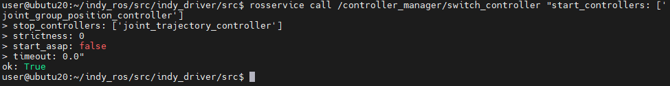

# Indy ROS1

## Introduction

**Indy** is Neuromeka's flagship cobot model we designed and manufactured. Guaranteeing workers safety based on innovative collision detection algorithms, Indy supports more intuitive direct teaching by impedance control as well as online and offline programming with the teach pendant app running on android tablets.

<center></center> 


This repository contains ROS1 Noetic drivers for Indy7, Indy7V2, IndyRP2, IndyRP2V2, Indy12 and Indy12V2.


## Preparation

The following software needs to be installed:
- [ROS1 Noetic](https://wiki.ros.org/noetic/Installation)
- indyDCP3
    ```bash
    pip3 install neuromeka
    pip3 install --upgrade neuromeka
    ```

## Installation

### Install dependencies
```bash
sudo apt install ros-noetic-ros-control \
ros-noetic-ros-controllers \
ros-noetic-industrial-robot-client \
spacenavd \
ros-noetic-ompl \
ros-noetic-spacenav-node \
ros-noetic-warehouse-ros-mongo \
ros-noetic-moveit-ros \
ros-noetic-moveit-servo \
ros-noetic-moveit-planners \
ros-noetic-moveit-simple-controller-manager
```

### Download the source code and build

```bash
git clone <this repository url>
cd ~/indy-ros/
catkin_init_workspace src/
sudo chmod +x src/indy_driver/src/*
catkin_make
```

### Source the setup file

```bash
source /opt/ros/noetic/setup.bash
```

```bash
source devel/setup.bash
```

## Usage

Use **indy_type** to choose specific robot **(indy7, indy7_v2, indy12, indyrp2, indyrp2_v2)**.\
Use **indy_eye** to enable Indy Eye model **(support indy7, indyrp2, indy7_v2, indyrp2_v2)**.\
To enable Indy Eye, add **indy_eye:=true** to the end of command

If not specified, the default value will be indy7.\
When used with a real robot, you need to provide an **indy_ip** value.

**Servoing mode with Keyboard**\
*Common Use*\
Use arrow keys and the '.' and ';' keys to Cartesian jog\
Use 'W' to Cartesian jog in the world frame, and 'E' for the End-Effector frame\
Use 'N' 'M' ',' for the Task move UVW\
Use 1|2|3|4|5|6|7 keys to joint jog. 'R' to reverse the direction of jogging.\
Use '-' '+' to adjust joint speed\
Use '9' '0' to adjust task speed\
'Q' to quit.\
*On Real Robot*\
Use 'H' to move Home, 'Z' to move Zero, 'S' to Recover, 'P' to stop Teleop\

**Generate your URDF files**\
You can generate your URDF files using **generate_all_urdfs.sh** file in **indy_description/urdf** folder
```bash
cd </..path../..to../indy_description/urdf/>
sudo chmod +x generate_all_urdfs.sh
./generate_all_urdfs.sh
```

### Start Indy description

```
roslaunch indy_description indy_description.launch indy_type:=indy7_v2
```
<center></center>

### Simulation Robot

**Start Indy Robot**

```
roslaunch indy_gazebo indy_gazebo.launch indy_type:=indy7_v2
```

<center></center>

**Start Indy with MoveIt**

Open new terminal and run following command:
```
roslaunch indy_moveit moveit_gazebo.launch indy_type:=indy7_v2
```
<center></center>

**Start Indy with Servoing**
Open 2 new terminals and run following commands:

Launch spacenav
```
roslaunch indy_moveit spacenav.launch
```

Change controller for gazebo
```
rosservice call /controller_manager/switch_controller "start_controllers: ['joint_group_position_controller']
stop_controllers: ['joint_trajectory_controller']
strictness: 0
start_asap: false
timeout: 0.0"
```

You should see the result as below:
<center></center>

Start servo with keyboard

```
roslaunch indy_driver indy_servo_keyboard.launch
```

### Real Robot

**Start Indy Robot**

Start Indy with rviz
```
roslaunch indy_driver indy_bringup.launch indy_ip:=192.168.xxx.xxx rviz:=true
```
<center></center>


**Start Indy with MoveIt**

Please close Indy with rviz and start this 2 commands:

```
roslaunch indy_driver indy_bringup.launch indy_ip:=192.168.xxx.xxx
```

```
roslaunch indy_moveit moveit_indy.launch
```

<center></center>

**Start Indy with Servoing**

Open 2 new terminals and run following commands:

Launch spacenav
```
roslaunch indy_moveit spacenav.launch
```

Start servo with keyboard

```
roslaunch indy_driver indy_servo_keyboard.launch is_sim:=false
```
